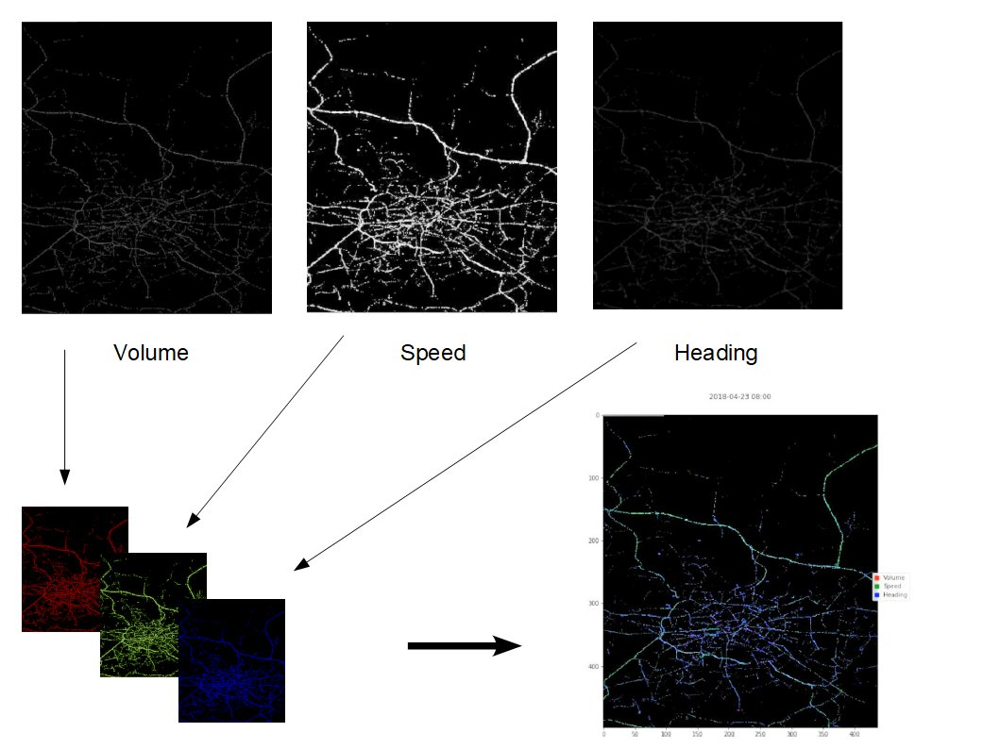
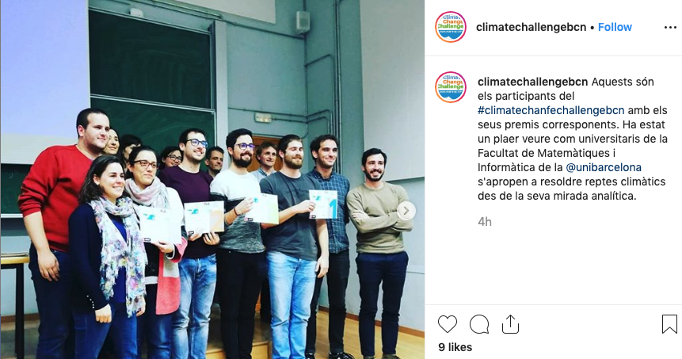
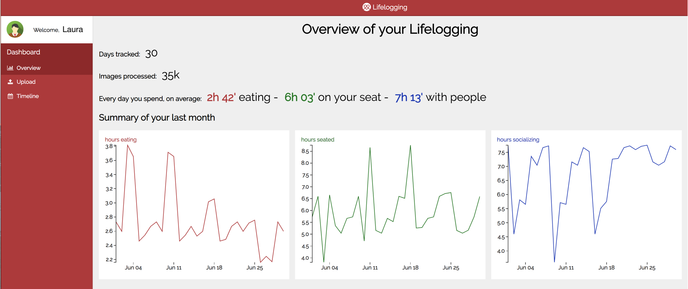
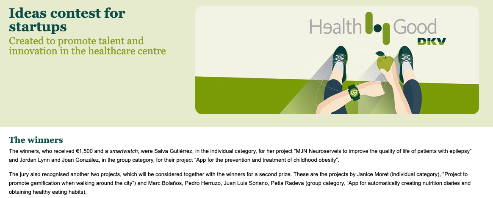

# Awards

## Outstanding contribution in the Traffic4cast competition

Dec 2019 · Vancouver, Canada  
by the Institute of Advanced Research in Artificial Intelligence (IARAI), in NeurIPS 2019 conference

Traffic4cast is a challenge inside the NeurIPS 2019 conference organized by IARAI. The objective is about predicting traffic states (average speed, number of vehicles, and main traffic direction) in three different cities: Moscow, Istanbul, and Berlin with data provided by Here.

Three best scores in the leaderboard got a cash prize, but the jury also selected only 4 more projects they believe had an outstanding contribution, with a reward of a free entrance to NeurIPS 2019 conference, and the publication of an extended abstract. This is what we won.

Links: [Competition website](https://web.archive.org/web/20231129014932/https://www.iarai.ac.at/traffic4cast/), [paper/code website](https://github.com/pherrusa7/Traffic4cast_NeurIPS_2019).

## 3th position in the Climate Change Challenge

Nov 2019 · Barcelona, Spain  
by the University of Barcelona, ISGlobal, and Ajuntament de Barcelona

The objective of this challenge is to model the weather in the city of Barcelona in the best possible way. Using temperature, precipitation, humidity and other variables in a set of 4 stations in the city, we were asked to predict the real average temperature in the city, together with the best location for extra stations that could benefit the measurements in real life. We also presented different creative use cases that could benefit from installing the proposed physical stations. Link to the [website](http://climate-challenge.herokuapp.com/) and [instagram](https://www.instagram.com/p/B44gqxAIInk/) of the challenge.

## 1st position in the Big Data Talent Awards for the best master thesis

Nov 2018 · Barcelona, Spain  
by the Big Data & AI Congress Barcelona

This congress named our work the best master thesis out of all presented manuscripts. In our work, we took one step further in the direction of self-quantify lifestyle patterns, analyzing first-person stories by means of egocentric pictures acquired throughout the whole active day with wearable cameras.

Our work use AI in order to quantify when a person is socializing with other people or alone, when is sitting or standing, or when she or he is buying grocery, cooking, eating or neither of that. We introduce the first prototype of a website where the user can upload the pictures of the whole day and get a dashboard with these measurements.

Links: [Live presentation on Youtube](https://www.youtube.com/watch?v=cqcCK3YHDVk&t=4m13s), [conference slides](http://cdn.bdigital.org/PDF/BDC18/BDC18_TalentAwards.pdf), [data preprocessing code](https://github.com/alsoba13/LAP-Annotation-Tool), [model code](https://github.com/lauraportell/LAP-LifestylePatterns-Classification), [news](https://www.europapress.es/catalunya/noticia-expertos-big-data-constatan-impacto-transformacion-banca-industria-salud-20181025173425.html).

## Project recognition in the "Ideas contest for startups", group category

Nov 2016 · Barcelona, Spain  
by DKV Seguros Health4Good

We participated in a very demanding contest for startup ideas, and we got recognized together with the winners for a second prize. We presented an App that can create nutrition diaries automatically from only pictures, and propose healthy eating habits from it. Links to related news: [1](https://eng.dkvseguros.com/medicos-y-centros/salud-digital/health4good/ganadores?__hsfp=998628806&__hssc=184240313.1.1541721600067&__hstc=184240313.82af9c9a98fa600b1bb630f9cde2cb5f.1541721600064.1541721600065.1541721600066.1&_ga=2.24696319.435809157.1574709637-1558920768.1574709637), [2](https://prnoticias.com/periodismo/20157723-dkv-revoluciona-la-salud#inline-auto1611), [3](https://www.diarioabierto.es/337445/dkv-presenta-la-plataforma-mi-salud-al-dia).

---

[Home](../index.md) > [About me](index.md)
