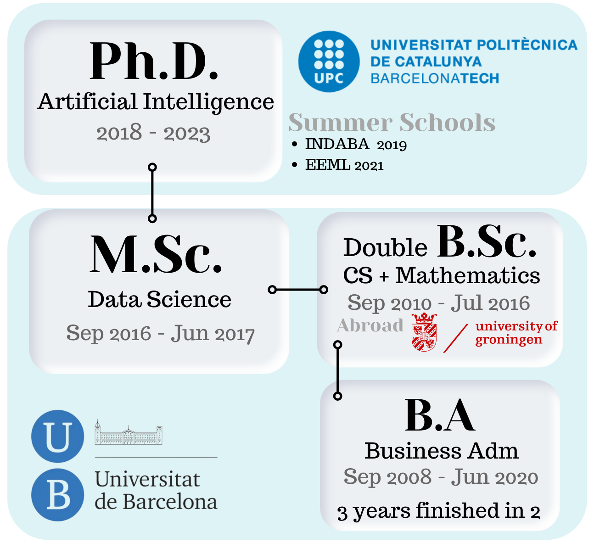
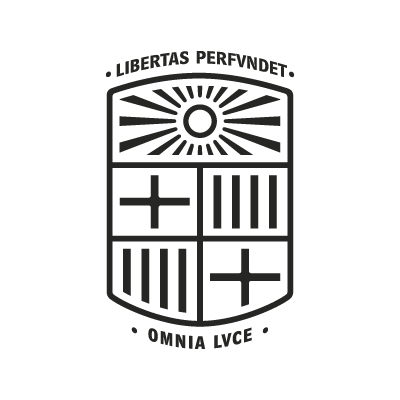
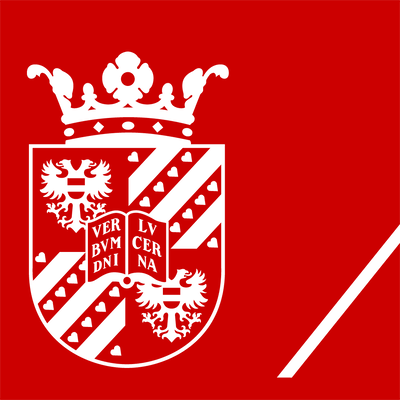

# Education

- Double BSc in Mathematics and Computer Science
- BSc in Business Administration completed in 2 years, despite being a 3-year official program with an average completion time above 5 years
- MSc in "Foundations of Data Science"
- PhD in Artificial Intelligence

## Polytechnic University of Catalonia

Doctor of Philosophy - PhD · Artificial Intelligence and Smart Mobility  
2018 - 2022

## Kenyatta University

Summer School · Deep Learning Indaba 2019  
2019 - 2019

Strengthen African Machine Learning.

## University of Barcelona

Master of Science - MS · Fundamental Principles of Data Science  
2016 - 2017

Machine Learning, Deep Learning, Bayesian Statistics, Optimization, Numerical Linear Algebra, Complex Networks, Probabilistic Graphical Models...

## University of Groningen

Bachelor of Science - BS · Mathematics and Computer Science  
2016 - 2016

Neural Networks, Computer Graphics, Algebraic Structures, and Geometry and Topology. Bachelor thesis with title: Can a CNN recognize Mediterranean food?

## University of Barcelona

Bachelor of Science - BS · Mathematics  
2010 - 2016

## University of Barcelona

Bachelor of Engineering - BE · Computer Engineering  
2010 - 2016

## University of Barcelona

Bachelor of Business Administration - BBA · Business Administration and Management  
2008 - 2010

---

[Home](../index.md) > [About me](index.md)
