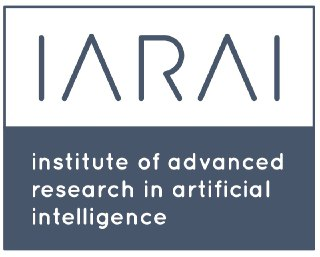

# Experience

## Founding AI Engineer

**Impossible Inc**  
March 2025 - Present  
SF, California, USA

In stealth with [Maxime Coutte-Peroumal](https://x.com/maximecperoumal), [Naval Ravikant](https://nav.al/do), and a few other talented people: building foundational GenAI models that interact with the world in 4D.

## UNISON

SF, California, USA

### Lead Engineer, AI and Spatial Computing

June 2023 - March 2025

- Led a team of 9 PhDs and engineers from Apple, Meta, and Stanford to ship core models and algorithms for a spatial computing OS, including head tracking, hand tracking, speech-to-text, text-to-speech, scene reconstruction, and simulation.
- Built a multimodal spatial assistant for interacting with digital content in VR using LLMs, voice, eye tracking, and hand tracking.
- Built a distributed pub/sub system for real-time inference of large AI models in VR/AR.
- Developed proprietary tools for data capture, auto-labeling, and multimodal 3D data analysis.
- Built prototype VR/AR experiences that pushed the OS through realistic interaction scenarios and exposed performance, latency, and model-quality bottlenecks.

### AI Engineer

May 2022 - June 2023

- Pioneered real-time 3D computer vision systems, including hand tracking, visual-inertial SLAM, and scene reconstruction.
- Co-designed a custom Time-of-Flight sensor for real-time 3D AI perception.

## AI Scientist

**IARAI - Institute of Advanced Research in Artificial Intelligence**  
Feb 2020 - May 2022  
Vienna, Austria / remote

- Created the video-encoding competition and benchmark [Weather4cast NeurIPS 2022](https://neurips.cc/Conferences/2022/CompetitionTrack) with Prof. [Sepp Hochreiter](https://en.wikipedia.org/wiki/Sepp_Hochreiter) and Prof. [David Kreil](https://www.semanticscholar.org/author/David-P.-Kreil/29846943), including [neural-network baselines for weather](https://github.com/iarai/weather4cast-2022).
- Built user-friendly [tools](https://github.com/pherrusa7/Sentinel5P) for retrieving and processing satellite data from Sentinel-5P.
- Co-organized the [1st Workshop on Complex Data Challenges in Earth Observation](https://dl.acm.org/doi/10.1145/3459637.3482044) at [CIKM 2021](https://www.cikm2021.org/programme/workshops/CDCEO), with 25+ speakers, posters, and keynotes.
- Organized the [Weather4cast](https://github.com/iarai/weather4cast) competition from scratch for 300+ ML researchers at [IEEE Big Data Cup 2021](http://bigdataieee.org/BigData2021/BigDataCupChallenges.html), designing the website funnel and scoring script to evaluate submitted predictions.
- Co-organized [Traffic4cast](http://traffic4cast.ai/) competitions at NeurIPS [2020](https://neurips.cc/Conferences/2020/CompetitionTrack), [2021](https://neurips.cc/Conferences/2021/CompetitionTrack), and [2022](https://neurips.cc/Conferences/2022/CompetitionTrack). Published 3 articles.
- Co-organized [Science4cast](https://github.com/iarai/science4cast), a benchmark for predicting emerging science, with Prof. [Mario Krenn](https://scholar.google.at/citations?user=jzG7GC8AAAAJ&hl=de).

## Machine Learning & Data Scientist

**SEAT, S.A.**  
Sep 2017 - Sep 2020  
Barcelona, Spain

- Designed a deep learning model that predicts traffic jams from past traffic, weather, and seasonality. Awarded paper at NeurIPS 2019 Competition Track with Prof. [JL Larriba-Pey](https://scholar.google.es/citations?user=REzYdQgAAAAJ&hl=en).
- Designed a hybrid model that recommends transportation modes using expert systems and ML, integrated with the user's calendar, weather, public mobility services, and private mobility services.
- Created a dashboard to monitor AI model performance, highlighting prediction errors, inference times, and worst-predicted users.
- Established a partnership between Waze, SEAT, and the city of Barcelona to enhance mobility prediction with planned events, such as soccer games, and improve routing around traffic disruptions.
- Spotted and corrected bugs in Barcelona's open traffic-loop-detector data, improving the public dataset used by the city and external mobility researchers.

## Graduate Research Fellowship

**Computer Vision Group @ University of Barcelona**  
Sep 2016 - Jul 2017  
Barcelona, Spain

- Won best master thesis award for a multi-task deep learning model recognizing lifestyle patterns, such as time spent eating, socializing, and sitting, from wearable cameras. Published 2 articles.
- Developed a web dashboard that automatically analyzed wearable-camera images and reported lifestyle patterns using our deep learning models.
- Added explainable AI views so users could see which image features drove the model's predictions, with Prof. [Petia Radeva](https://scholar.google.com/citations?user=p_MCjd4AAAAJ&hl=es).
- Designed the deep learning model for an automatic nutrition diary app from pictures, with suggestions for healthy eating habits. Scored 2nd in a startup contest and published 1 article.
- Built scraping algorithms to create a Mediterranean food dataset with 115 dishes and 75,000+ images.

## Data Scientist

**Indra Sistemas, S.A.**  
May 2014 - Feb 2016  
Barcelona, Spain

Exploitation of the Commercial Segurcaixa Data Warehouse, Vidacaixa.

- Worked 30h/week while studying the double B.Sc. in Computer Science and Mathematics.
- Generalized PowerCenter processes, reducing errors and ETL workflow time by 10x.
- Built a project management tool for tracking and reporting time spent per project.
- Translated client requirements into operational reporting tools using SAP BO, PowerCenter, Oracle, and Control-M.

---

[Home](../index.md) > [About me](index.md)
