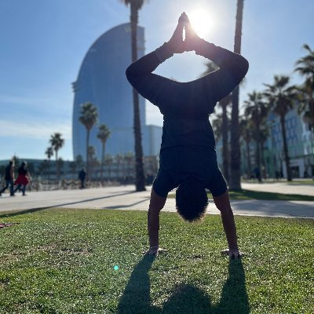

# Pedro Herruzo

Founding AI Engineer at [Impossible Inc](https://nav.al/do) working on real-time spatio-temporal GenAI systems, spatial computing, and data-heavy products.

## About Me

I build real-time AI systems for the physical world: currently generative models for space-time interactions, grounded in sensor pipelines and experienced in VR; previously large-scale forecasting benchmarks for traffic and weather. I care about the whole stack because that is where the hard problems hide: data capture and quality, async and distributed inference, latency, model quality, and the product loop. I'm drawn to research problems that make reality more compressible and predictable, especially how to encode 4D world structure into models. I ask "why" until the problem reduces to its real constraints.

## Career and Research

- [Experience](experience.md)
- [Publications](publications.md)
- [Talks](talks.md)
- [Awards](awards.md)
- [Education](education.md)

## Links

[Twitter](https://twitter.com/HerruzoPedro)&nbsp;&nbsp;&nbsp;
[LinkedIn](https://www.linkedin.com/in/pherrusa7/)&nbsp;&nbsp;&nbsp;
[GitHub](https://github.com/pherrusa7)&nbsp;&nbsp;&nbsp;
[Google Scholar](https://scholar.google.com/citations?user=uvXH2PYAAAAJ&hl=en)&nbsp;&nbsp;&nbsp;
[Quora](https://www.quora.com/profile/Pedro-Herruzo)&nbsp;&nbsp;&nbsp;
[DBLP](https://dblp.uni-trier.de/pers/hd/h/Herruzo:Pedro)&nbsp;&nbsp;&nbsp;
[CV](https://drive.google.com/file/d/1FLn1ztJaG2tDWPmniKXVzdCmMzSg0Jl9/view?usp=sharing)&nbsp;&nbsp;&nbsp;

For conventional communication, send me an [email](mailto:pedro.herruzo@iarai.ac.at).

---

[Home](../index.md)
