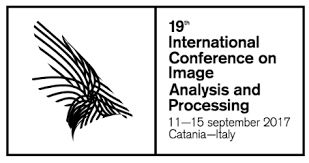

# Publications

All papers, with links, live in this [shared publication sheet](https://docs.google.com/spreadsheets/d/11XniDieCpQxBLtHiOTBwJvUXoB7YQGLfAgQqabawHDI/edit?usp=sharing).

## Traffic4cast at NeurIPS 2020 - yet more on the unreasonable effectiveness of gridded geo-spatial processes

Aug 2021 · PMLR · NeurIPS 2020

Michael Kopp, David Kreil, Moritz Neun, David Jonietz, Henry Martin, Pedro Herruzo, Aleksandra Gruca, Ali Soleymani, Fanyou Wu, Yang Liu, Jingwei Xu, Jianjin Zhang, Jay Santokhi, Alabi Bojesomo, Hasan Al Marzouqi, Panos Liatsis, Pak Hay Kwok, Qi Qi, Sepp Hochreiter

The IARAI Traffic4cast competition at NeurIPS 2019 showed that neural networks can successfully predict future traffic conditions 15 minutes into the future on simply...

Links: [Paper](http://proceedings.mlr.press/v133/kopp21a.html), [Code](https://github.com/iarai/NeurIPS2020-traffic4cast)

## The surprising efficiency of framing geo-spatial time series forecasting as a video prediction task-Insights from the IARAI Traffic4cast Competition at NeurIPS 2019

Aug 2020 · PMLR · NeurIPS 2019

David P Kreil, Michael K Kopp, David Jonietz, Moritz Neun, Aleksandra Gruca, Pedro Herruzo, Henry Martin, Ali Soleymani, Sepp Hochreiter

Deep Neural Networks models are state-of-the-art solutions in accurately forecasting future video frames in a movie. A successful video prediction model needs...

Links: [Paper](http://proceedings.mlr.press/v123/kreil20a/kreil20a.pdf), [Code](https://github.com/iarai/NeurIPS2019-traffic4cast)

## Recurrent Autoencoder with Skip Connections and Exogenous Variables for Traffic Forecasting

Dec 2019 · PMLR · Traffic4cast Challenge @ NeurIPS 2019

Pedro Herruzo, Josep L. Larriba-Pey

The increasing complexity of mobility plus the growing population in cities, together with the importance of privacy when sharing data from vehicles or any device...

Links: [Paper](http://proceedings.mlr.press/v123/herruzo20a/herruzo20a.pdf), [Code](https://github.com/pherrusa7/Traffic4cast_NeurIPS_2019)

## Towards Objective Description of Eating, Socializing and Sedentary Lifestyle Patterns in Egocentric Images

Sep 2019 · BMVC 2019

Pedro Herruzo, Laura Portell, Alberto Soto, Beatriz Remeseiro

The objective description of lifestyle patterns from egocentric images captured by wearable cameras is considered the next step on health-tracking applications...

Links: [Paper](https://bmvc2019.org/wp-content/EGOAPP19/EgoApp2019_2.pdf), [Code](https://github.com/lauraportell/LAP-LifestylePatterns-Classification)

## Analyzing First-Person Stories Based on Socializing, Eating and Sedentary Patterns

Sep 2017 · ICIAP 2017

Pedro Herruzo, Laura Portell, Alberto Soto, Beatriz Remeseiro, Petia Radeva

First-person stories can be analyzed by means of egocentric pictures acquired throughout the whole active day with wearable cameras. This manuscript...

Links: [Paper](https://arxiv.org/pdf/1707.07863.pdf), [Code](https://github.com/alsoba13/LAP-Annotation-Tool)

## Can a CNN recognize Catalan diet?

Oct 2016 · AIP Conference Proceedings

Pedro Herruzo, Marc Bolaños, Petia Radeva

Nowadays, we can find several diseases related to the unhealthy diet habits of the population, such as diabetes, obesity, anemia, bulimia, and anorexia. In many...

Links: [Paper](https://aip.scitation.org/doi/10.1063/1.4964956)

---

[Home](../index.md) > [About me](index.md)
