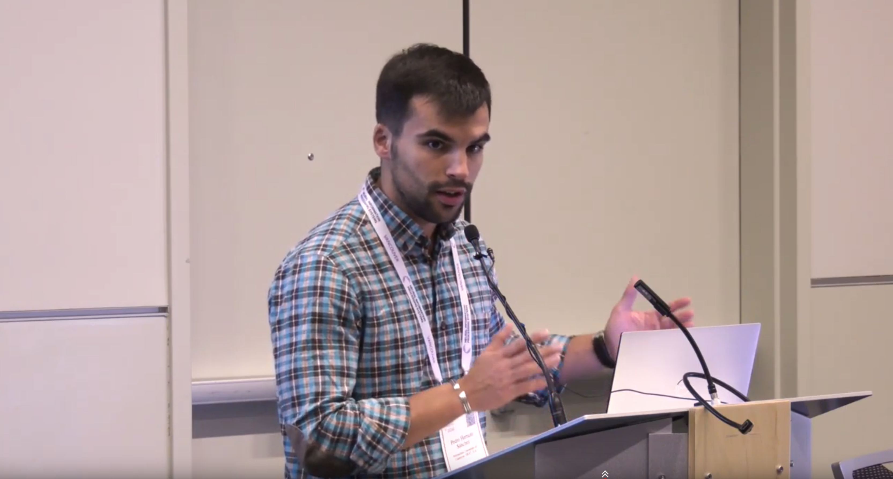
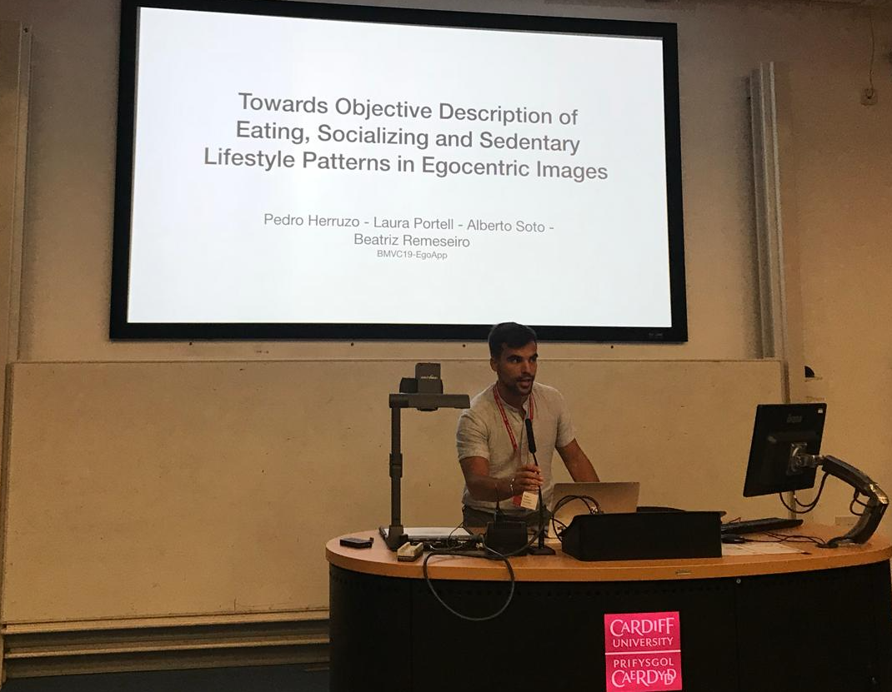
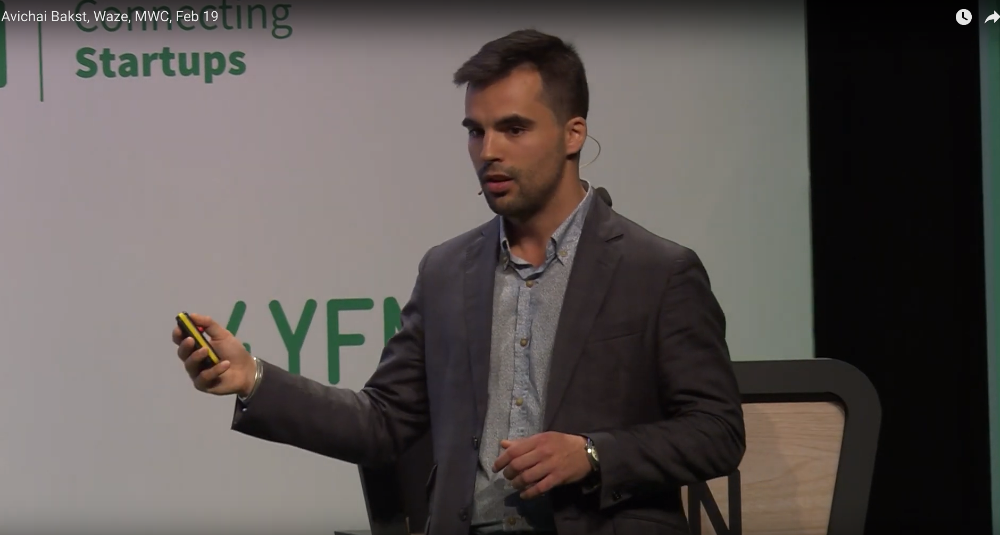
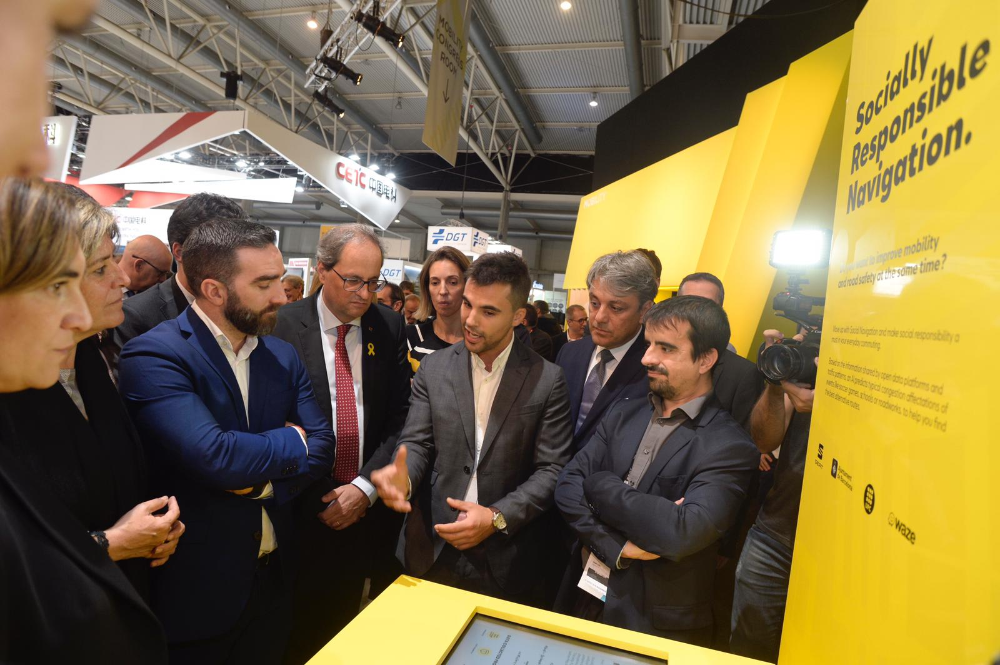
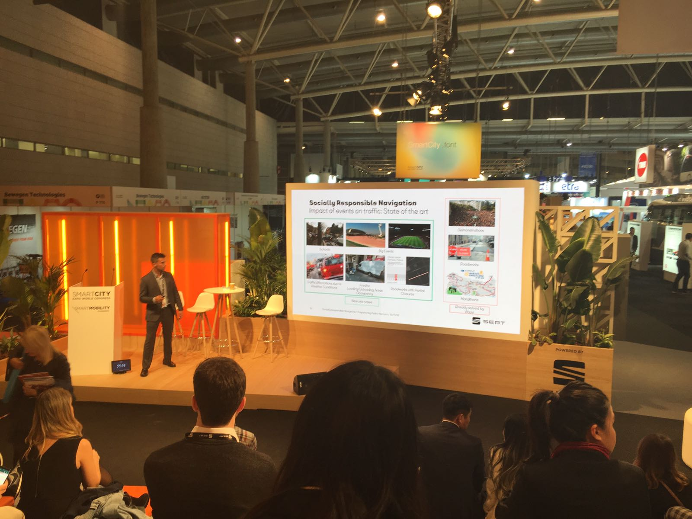
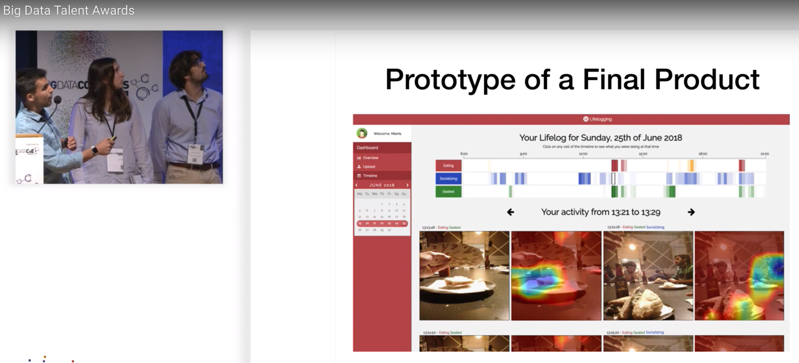
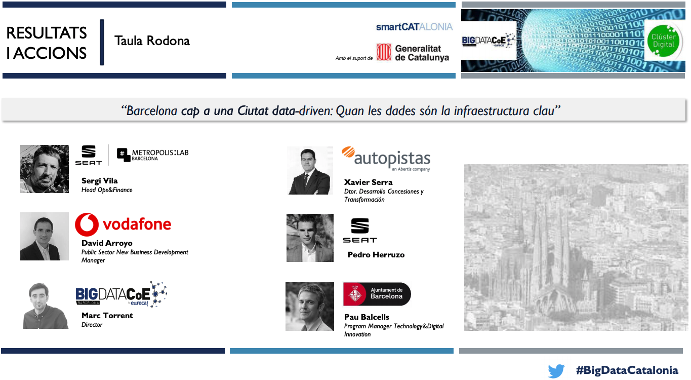
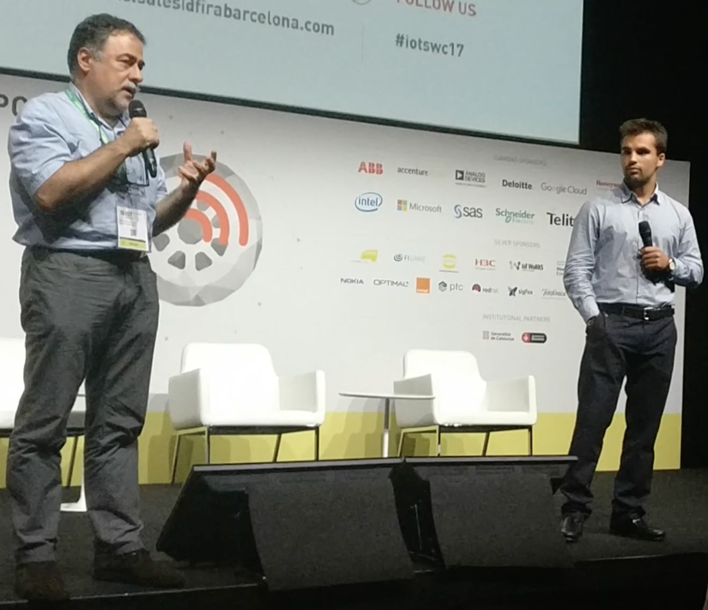

# Talks

## Weather4cast 2021

Dec 2021 · Florida, USA · IEEE Big Data Conference

Brief explanation at ICML 2021 of the [Weather4cast competition](https://web.archive.org/web/20211226043115/https://www.iarai.ac.at/weather4cast/), a benchmark for satellite imagery multi-channel weather prediction using machine learning.

Video: [YouTube](https://www.youtube.com/watch?v=1DRZaiUlfUE&ab_channel=IARAIResearch)

## Recurrent Autoencoder with Skip Connections and Exogenous Variables for Traffic Forecasting

Dec 2019 · Vancouver, Canada · Conference on Neural Information Processing Systems - NeurIPS

Giving the talk of our paper "Recurrent Autoencoder with Skip Connections and Exogenous Variables for Traffic Forecasting", accepted as an outstanding contribution to the Competition Track 'Traffic4cast' in NeurIPS 2019.

Links: [YouTube](https://youtu.be/8y_Pwiy9C5M?t=2681), [SlidesLive](https://slideslive.com/38922888/traffic4cast-traffic-map-movie-forecasting?locale=de) min 44:34, english.

## Keeping Society Moving In A Connected World

Sep 2019 · Cardiff, UK · British Machine Vision Conference

Giving the talk of our paper "Towards Objective Description of Eating, Socializing and Sedentary Lifestyle Patterns in Egocentric Images", accepted in BMVC 2019.

## Keeping Society Moving In A Connected World

Feb 2019 · Barcelona · 4YFN, side event of the Mobile World Congress  
with Avichai Bakst, Director of Business Development at Waze

Avichai Bakst and me talking about the partnership of Waze, SEAT S.A., and the city council of Barcelona under the Connected Citizens Program of Waze.

Video: [YouTube](https://youtu.be/qERNVybd1Z8?t=628), english.

## Socially Responsible Navigation

Nov 2018 · Barcelona · Smart City Expo World Congress  
with Luca de Meo, presindent of SEAT, S.A., and Jordi Caus, head of future urban concepts

In picture:

1. from SEAT S.A.: Luca de Meo (president), Jordi Caus (head of future urban concepts), and myself explaining the project of my thesis in SEAT S.A. and UPC.
2. from the city council of Barcelona: Roger Torrent (president of the Parliament of Catalonia), Quim Torra (president of the Government of Catalonia), and Ada Colau (mayor of the city of Barcelona).

More information: [fleetnews](https://www.fleetnews.co.uk/news/manufacturer-news/2018/11/14/seat-showcases-mobility-innovations-at-smart-city-expo-world-congress), [SEAT, S.A.](https://web.archive.org/web/20260429224253/https://www.automotiveworld.com/news-releases/seat-showcases-its-potential-on-the-path-to-safer-more-efficient-mobility/), and a visual explanation on [YouTube](https://www.youtube.com/watch?v=Qo0mbgm5sHA).

## Socially Responsible Navigation

Nov 2018 · Barcelona · Smart City Expo World Congress

Giving the talk of the project, a collaboration of SEAT S.A., Waze, the city council of Barcelona and the Polytechnic University of Catalonia.

## Big Data Talent Awards for the best master thesis

Nov 2018 · Big Data & AI Congress Barcelona Congress  
with Laura Portell and Alberto Soto

This congress named our work the best master thesis out of all presented manuscripts. The live presentation can be found on [YouTube](https://www.youtube.com/watch?v=cqcCK3YHDVk&t=4m13s), spanish.

## Barcelona towards a data-driven City: When data is the key infrastructure

Oct 2018 · Barcelona · Open Data Barcelona

In this round-table, I was defending the importance of public-private cooperation in order to improve urban mobility through a common data-layer in the city called Open Data. Link to the [slides](https://media.timtul.com/media/web_clusterdigital/20181025-Presentacio_BDC_20181029113757.pdf).

## SEAT S.A. from a Car Manufacturer to a Mobility provider

Nov 2017 · Barcelona · IOT Solutions World Congress  
with Josep L. Larriba-Pey, Co Founder of Sparsity Technologies

In this talk, I was explaining relevant projects in SEAT S.A. in the transition from being only a car manufacturer towards a mobility provider. Link to related [news](https://web.archive.org/web/20171030094917/http://sparsity-technologies.com/blog/).

---

[Home](../index.md) > [About me](index.md)
